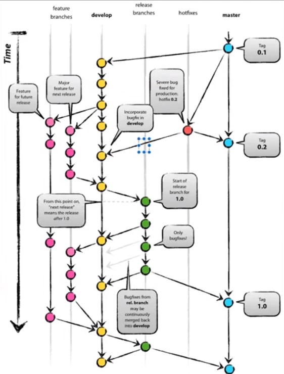
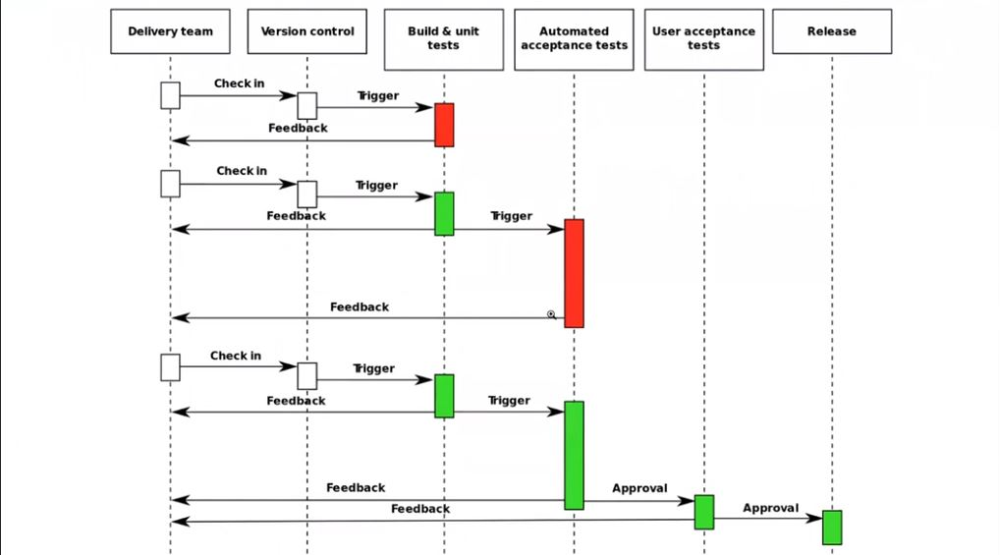

# Comandos de GIT, características, conflictos y más.

#### Por **Jonathan Rodríguez**.

## git init:

Inicializa un repositorio local. Crea la carpeta .git.

## git --bare:

crea un repositorio que no cuenta con un directorio de trabajo, lo que imposibilita la edición de archivos y la confirmación de cambios en ese repositorio. Podrías crear un repositorio bare para aplicar los comandos git push y git pull, pero nunca realizar confirmaciones directamente en él.

Son repositorios remotos propios, es decir, prescindimos de servicios de hosting de git como GtiHub por un repositorio remoto de nuestra propiedad. Dos características importantes que debemos destacar. No cuentan con Working Directory. Se trabaja a través de push y pull.

## git clone https://github.com/my-account/my-repo-name.git:

Nos permite descargar un repositorio remoto a una dirección local de nuestro ordenador.

## git diff:

Nos muestra que cambios se han realizado sobre los archivos modificados que aun no se han enviado al repositorio local (commit). Aunque, si se trata de archivos binarios, no mostrará el contenido ni los cambios pero sí indicará que hay modificaciones en él.

## git pull:

Permite extraer y descargar contenido desde un repositorio remoto y actualizar al instante el repositorio local para reflejar ese contenido.

## git add .:

Agregra TODOS los cambios en todos los archivos para ser comiteados, sin embargo no se aconseja agregar elementos de esta manera. Lo ideal es agregar uno por uno para evitar que se agregue algo que no deseemos que se vaya a comitear aun o subir al repo remoto.

## git commit -m "":

Permite trackear todos los cambios en el repositorio local para ser subidos al repositorio remoto
Si usamos la bandera -s, esta agrega una línea en el commit que indica "Signed-off-by: Fulano de Tal <fulano@sutano.com>", es decir indíca que el cambio está firmado por el usuario que realiza el commit. Normalmente se utiliza cuando vamos a contribuir en un proyecto importante y queremos asegurar que quien realiza el commit es realmente el autor de ese código y no está infringiendo nada.

## git push:

Permite enviar todos los archivos y cambios comiteados al repositorio remoto.

## git status:

Permite conocer que archivos estan sin trackear o comitear.

## git fetch:

Permite ver si han habido cambios remotos y de haberlos, obtenemos los metadatos de esos cambios.

## git log:

Permite ver la lista de los commits realizados con sus respectivos códigos de confirmación.

## git log --oneline:

Resume todos los commits id´s de las operaciones realizadas con sus respectivos mensajes de confirmación.

## git reset --soft HEAD~id_commit:

Permite deshacer cambios y volver a un comit anterior específico sin borrar archivos. El numeral debe ser reemplazado con el numero de commits a eliminar.

## git reset --hard HEAD~id_commit:

Permite deshacer cambios y volver a un comit anterior específico pero borrando los archivos descartados por los commits deshechos. El numeral debe ser reemplazado con el numero de commits a eliminar.

## git bisect start:

Permite seccionar el historial de commits para buscar un punto que pudo haber causado problemas en el código.

## git bisect good:

Después del paso anterior, permite indicar el punto en donde el código funcionaba.

## git bisect bad:

Después del paso anterior, permite indicar cual fue el commit que dañó el código.

## git bisect reset:

Al realizar un git bisect, este se moverá desde la rama main hacia una rama temporal en el commit seleccionado como good. Este comando permite volver a la rama main y rehacer todos los commits, incluyendo el seleccionado como bad.

## git blame nombredelarchivo.\*\*\*:

Analiza un archivo completamente e indica quien realizó modificaciones, cuales fueron las modificaciones, fecha de las modificaciones.

# Ramas:

Es una bifurcación del historial de confirmaciones, pudiendo tener un historial de confirmaciones paralelo que no estará mezclado con otras bifurcaciones.
Se utilizan para tener multiples versiones de desarrollo. Se puede crear una rama para corregir un error en nuestra rama principal.

## git branch:

Nos muestra las ramas actuales pero tambien permite crear una rama, es la primera forma de hecho de crear ramas.

`git branch ejemplo` -> Esto funcionará siempre y cuando tengamos un commit previo en la rama main. Creamos la rama demo.

## git checkout nombreRama:

Permite cambiar de una rama a otra.
Sim embargo, con este comando también podemos crear una rama y cambiarnos a ella en un solo paso.
Si utilizamos ese comando y colocamos `-b` + el nombre de la rama que deseamos crear, automáticamente nos creará la rama y nos cambiará a ella, por ejemplo: `git checkout -b ejemplo`.

También, es posible crear una nueva rama en desde la rama principal, pero desde un commit anterior.

`git branch nueva_rama 654g15c` -> este código, debe ser el código de confirmación del punto desde donde se desea crear la nueva rama.

Lo común no es desarrollar en la rama "main", lo común es que cada vez que se vaya a realizar un cambio en el código se cree una nueva rama para luego, una vez verificado y comprobado, se fusionen los cambios con la rama principal. Fusionar los cambios consiste en meter todos los cambios creados en una rama, siempre que sea posible, en otra rama.

Las ramas las podemos utilizar de forma remota.
Cuando tenemos una rama en el repositorio remoto y necesitamos trabajar en ella, usamos
`git pull origin nombre_rama`

`git checkout nombre_rama`.

Cuando creamos una rama trabajando en local, y necesitamos que esa rama aparezca en nuestro repositorio remoto, es necesario subirla y para ello usamos el comando:
`git push origin nombre_rama`.

Para eliminar una rama, usamos la siguiente sintaxis:
`git branch -D ejemplo` -> siendo ejemplo el nombre de la rama a borrar.

## git merge y git rebase:

El rebase unifica las ramas perdiendo el historial de los commit y el merge no . Esto puede resultar bien importante cuando se necesite llevar o saber el historial de commit y se esta trabajando con otros compañeros en esa rama.
Cuando trabajamos con un repositorio publico o compartido, algo que no esta tocando una sola persona, vamos a utilizar git merge; cuando lo usa una sola persona usaremos git rebase.

(desde main)
`git merge ejemplo` -> se trae todo lo creado desde la rama ejemplo y lo fusiona con main. En git, los merge son de dos tipos: `fast-forward` y `three-way-merge`.
El merge por fast-forward nos da un historial plano. Este se da cuando en la rama main no se ha realizado ningun cambio después de crear esa rama. Este sería el merge ideal pero es muy raro que ocurra.
En el otro caso, cuando se fusiona una rama secundaria con la rama principal y esta ya ha realizado otros commits, esta fusión obliga a realizar un nuevo commit que indica que se ha mergeado una rama x hacia main.

(desde main)
`git rebase ejemplo` -> El rebase permite hacer un merge reescribiendo el historial de confirmaciones. Funciona exactamente igual que el merge, sin embargo no genera ningun commit en donde agrege "Merge branch xxxx" como si lo haría el merge. Lo que hace con el historial de confirmaciones es intercalar entre el último y el penultimo log, las confirmaciones de esa rama.

Vamos a intentar usar siempre el git rebase en nuestro repositorio local. Cuando trabajamos con otras personas es necesario trabajar siempre con ramas. Rebase en local y merge en remoto.

## git stash:

EL comando `git stash` deja un directorio de trabajo limpio. Es muy útil cuando tenemos modificaciones en algunos archivos y debemos por urgencia trabajar en otros, pero si aun no estan terminados no podemos commitearlos ya que podrían romper el trabajo de otras personas.

Es como guardar en la dimensión espejo de Doctor Strange esos archivos sin comitear para que no nos estorben por el momento mientras podemos abordar otros archivos con premura.
Para volver a los archivos guardados temporalmente en la dimensión espejo, usamos:
`git stash apply`.

En orden lógico sería:
`git stash` -> `git stash apply`.

Los stashes son apilables, esto quiere decir que se pueden aplicar varios en un mismo segmento de trabajo.
podemos consultarlos con el comando:
`git stash list`.

Al consultar la lista, podemos ver los stashes qye tenemos; por defecto git le asigna el nombre del último commit que tuvimos, sin embargo el nombre lo podemos asignar nosotros de la siguiente manera:
`git stash save "Nombre del Stash"`.

Los stash se apilan en una estructura tipo pila UEPS, por lo que cuando creamos una pila de stashes los vamos sacando el comando:
`git stash pop` -> extrae el último que entró a la pila.

Podemos eliminar un stash con el comando:
`git stash clear`.

## git cherry-pick

Es un comando poderoso que permite seleccionar confirmaciones de Git arbitrarias por referencia y agregarlas al HEAD de trabajo actual. `Cherry picking` es el acto de seleccionar una confirmación de una rama y aplicarla a otra. git cherry-pick puede ser útil para deshacer cambios.

En torno a una serie de commits, yo voy a escoger el o los que más se ajusten a mis necesidades, por ejemplo, desde la rama main:

`git cherry-pick 6237a0b` || `git cherry-pick 6237a0b 21236de` -> Esto automáticamente se trae desde la rama en la que fue creado hasta la rama main dichos commits y los incorpora. Puedes usar un numero de confirmación o 2.

También es posible aplicar un rango de confirmaciones, es decir, desde un número de confirmación hasta otro (con otras confirmaciones en el medio), la sintaxis es la siguiente:

`git cherry-pick e567efd^..afbb7f5` -> es decir => comando + num_confirmación1 +`^..`+num_confirmación2

En este caso, el primer número de confirmación es `e567efd`, el segundo número es `afbb7f5`, pero en medio de estos, existen 2 números más de confirmación. Esta sintáxis incluye el número inicial y el final.

Existe otra sintáxis que no incluye esas posiciones:
`git cherry-pick e567efd..afbb7f5` -> Esto implica que solo que se tomarán las confirmaciones que estén entre el primer numero de confirmación y el segundo pero sin incluir ninguno de los dos.

Esto se utiliza habitualmente si generamos parches (seguridad o actualizaciones) desde una rama de mantenimiento para aplicar los cambios específicos que necesitemos a otras ramas en producción. Esto lo hace especialmente imprtante para no tener que buscar y hacer esos cambios a mano y correr el riesgo a equivocarnos.

# Workflow habitual de git:

Un Workflow en git es una forma de trabajar utilizando git; una convención de en qué orden se van a realizar las cosas. La convención más básica es: `update -> change -> review -> commit`.

Otra forma de trabajar es usando el ForkinWorkFlow, que consiste en que vamos a clonar un repositorio remoto, hacer los cambios y solicitar a su autor original que introduzca los cambios.

Hacer un fork significa que vamos a clonar en nuestra propia cuenta de usuario un repositorio de otra cuenta de usuario sobre la cual no tenemos ningún privilegio pero queremos contribuir. Una vez forkeado a nuestra cuenta, lo descargamos (`git clone`). Ya descargado podemos trabajar en los archivos que necesitemos.

Podemos subir los cambios realizados con git push. Cuando ya tenemos los cambios en Github, queremos hacer llegar esos cambios a su autor original, esto implica que debemos hacer un pull request. Esto significa que al repositorio original le quiero indicar que que he hecho un cambio en mi repositorio forkeado que puede invocar o puede utilzar cuando el quiera.

En Github, la opción para realizar el pull request es "`Contribute`". abre un modal indicando la opción "`Open pull request`"; Esta opción lleva directamente al repositorio original donde te indica "`Create pull request`", te permite escribir las anotaciones que consideres descriptivas y crear el pull request (PR).

# Hooks:

Git permite que alteremos el comportamiento de lo que hace; esto nos permite no estropear todo más allá de lo que deberíamos por inocentes. Git lo hace en 2 partes: `local_side` ó `server_side`.

Existen hooks que se ejecutan en ciertos momentos del ciclo de vida de git. Estos hooks son ficheros escritos en un lenguaje de programación que nosotros queramos pero que se tienen que poder ejecutar en nuestro sistema operativo. En Windows podremos utilizar ficheros \*.cmd ó _.ps _.ps1. En Linux típicamente se utilizan ficheros _.sh ó _.py ó \_.pl ó \*.php.

Estos ficheros se encuentran dentro de la carpeta .git, en una subcarpeta llamada hooks. En ella, hay una lista de ficheros que terminan en \*.sample. Y tienen esta terminación para que no se disparen automáticamente ya que normalmente lo hacen en un orden específico.

# GitLab

Mediante GitLab, podemos crearnos un repositorio vacio e interactuar con el desde la consola de VSC. Al clonarlo, podemos ingresar a ese repositorio y por ejemplo, a través del comando:
`git switch -c main` -> podemos cambiar desde la rama main a la rama main

Existe un repositorio padre que es "`origin`". Este repositorio no conoce la rama main por lo que al hacer el primer push, debemos indicar que cree esa rama. Para ello, usamos el comando:
`git push -u origin main`.

Después de esto, ya cualquier cambio que necesitemos subir lo haremos a través del comando -> `git push`.

# Tags:

Los tags se pueden agregar desde una rama en específico o desde un commit en particular y todos los commits anteriores a este también marcarán esa etiqueta.

`git tag` -> es el impulsor principal de una etiqueta: creación, modificación y eliminación. Hay dos tipos de etiquetas: anotadas y ligeras. Por lo general, las etiquetas anotadas son la práctica recomendada, ya que almacenan metadatos valiosos adicionales sobre la etiqueta.

`git tag -a nombre_tag id_commit` -> Crear un nuevo tag (no ligera) y lo asigna a un commit.

`git tag -d nombre-del-tag` -> Borra un tag en el repositorio local.

`git tag` -> Lista todos los tags de nuestro repositorio local.

`git push origin --tags` -> Publica un tag en el repositorio remoto.

# Gitignore:

Nos permite decirle a git que cuando hagamos una serie de cambios, esos cambios no los tenga en cuenta; y no se trata de cambios de código sino de ficheros en el repositorio. Es decir, aquí podemos indicar los tipos de ficheros que no queremos que git tome en cuenta, por lo que se ignorarán por completo. Sólo se puede tener un archivo .gitignore por repositorio.

Este archivo `.gitignore` es una de las primeras cosas que configuramos cuando creamos nuestro repo local.

La bandera `-f` ó `--force` puede forzar un comportamiento que de otra manera no se ejecutaría. En este caso, si existe una indicación dentro del `.gitignore` que diga que no tome en cuenta los archivos \*.c, a través del comando y de la bandera -f:
`git add -f ejemplo.c` -> podemos forzar a que se incluya el archivo ejemplo.c pese a que aparezca indicado dentro del git ignore.

Los comentarios dentro de este archivo comienzan con un #.
Se pueden agregar excepciones (`!`) a la hora de indicar un archivo específico cuya extensión haya sido colocada dentro del .gitignore para ser descartada, por ejemplo:
`!ejemplo.c` -> pese a que los archivos .c se ignorarán, este archivo se omitirá de esta regla y podrá agregarse, comitearse y pushearse.

# Remote:

Podemos trabajar con más de un remote a la vez, pushear cambios a varios remotes simultáneamente.
`cat .git/config` -> permite conocer el contenido de la carpeta config que se encuentra dentro de la carpeta oculta `.git`. En esta carpeta, en el apartado `[remote "origin"]` normalmente lo veremos de esta manera ya que naturalmente al crear un repositorio, "origin" será nuestro servidor padre.

`git remote add ejemplo https://github.com/my-account/my-repo-name.git` -> este comando permite crear un nuevo origin con el nombre ejemplo seguido de la url de ese repositorio remoto.

Para agregar cambios en ambos repositorios:

`git remote set-url --add origin --push all`

`git remote set-url --add ejemplo --push all`

Para subir esos cambios:

`git push origin`

`git push ejemplo`

No es muy común trabajar con 2 remotes simultáneos pero de esta manera es como lo haríamos.

# Conflictos:

Los conflictos surgen cuando dos personas han cambiado las mismas líneas de un archivo o si un desarrollador ha eliminado un archivo mientras otro lo estaba modificando. En estos casos, Git no puede determinar automáticamente qué es correcto.

A pesar de ello, es posible recuperar versiones anteriores y manipular parcialmente el historial para llegar a una versión previa al estado en el que nos encontramos, ya sea porque lo necesitamos, porque queremos o por cualquier otro motivo.

En el caso de presentarse algun conflicto al momento de hacer un merge:

`Auto-merging mensaje.txt
CONFLICT (content): Merge conflict in mensaje.txt
Automatic merge failed; fix conflicts and then commit the result.`

...el sistema nos da dos opciones:

`You have unmerged paths.
(fix conflicts and run "git commit")` -> arreglar el conflicto de forma manual seleccionando lo que deseamos conservar de los cambios y luego hacer el commit.

`(use "git merge --abort" to abort the merge)` -> ó utilizar el comando git merge --abort

Estos conflictos también se pueden dar cuando estamos trabajando con un repositorio remoto en el cual hay cambios pero que no los tengo en mi repositorio local, y en mi repo local también he modificado las mismas líneas en los mismos ficheros.

En este caso, al intentar pushear desde el repo local al remoto, aparece el conflicto indicándote que tu rama está por detrás de la rama principal. Aquí la solución pasa por hacer primero un git pull, luego git status para saber cual es el fichero que tiene el conflicto.

Abrimos el fichero y procedemos a elegir con que versión de código nos queremos quedar.
Luego git add ., git commit y git push. Esto acaba con el peo en cuestión!

## Versiones anteriores:

En git podemos recuperar versiones anteriores, anteriores a algunos cambios que hayamos realizado. Para ello tenemos que tener en cuenta los comandos: checkout, revert, amend, , reset y clean. Todos estos comandos sirven para trabajar con nuestro historial, para ver donde se han producido ciertos cambios.

`git log --branches='*'` -> muestra el historico de cambios de todas las ramas.

`git checkout` -> sirve para "deshacer" cambios que ya he hecho. Este comando sirve para cambiar de una rama a otra, pero también sirve para que en mi repo actual tenga como estaba mi repositorio en un momento dado del tiempo.

Por ejemplo:
`git checkout 69dfy74` -> cambia el HEAD del historial de commits hacia ese punto de confirmación en específico. Esto implica ponerse en modo 'detached HEAD'; esto significa que el commit principal se encuentra en otro lugar y que nos hemos movido a otra parte de nuestro repo local. Cualquier cosa que hagamos mientras nos encontremos en modo 'detached HEAD', será eliminada por git cuando se ejecute su recolector de basura.

Esto quiere decir que si agregamos ficheros en este modo y hacemos commits, estos no irán a ningún lado ya que se considerarían commits huerfanos. Si por el contrario queremos hacer cambios y poder mantenerlos y guardarlos, luego de hacer el checkout, debemos crear una rama en ese punto y trabajar sobre esa rama.
Para volver a la cabecera o HEAD ejecutamos git checkout main.

`git revert` -> sirve para deshacer commits insertando commits. Dicho de otra manera, deshace cambios. Con este comando podemos deshacer desde el HEAD hacia atrás dotos los commits. Lo que quiere decir es que vamos a deshacer los cambios introducidos por ese commit, sin embargo ese commit va a seguir existiendo; lo que se va a generar por así decirlo es un contra-commit nuevo que contiene lo opuesto al commit que quiero revertir. Su sintaxis es:
`git revert id_commit` -> esto revierte la confirmación que se indique.

Cuando trabajamos en proyectos Open Source, lo normal es que cuando la cagamos hagamos un git revert. Con esto podemos deshacer multiples commits y siempre desde el último hacia atrás.

Por ejemplo:
`git revert 1bba8a4 8cf7abf 4848acf -n` -> en este caso el primer commit que coloco en el comando es el que aparece como HEAD y consecutivamente los anteriores a el. Aquí, la bandera -n evita que se genere el nuevo commit que se crea con el revert.

Luego de esto, hacemos un nuevo commit indicando para el registro que se finaliza la reversión.
Los cambios que se generan son a nivel de ficheros o archivos involucrados. Esto nos permite mantener un historial completo. **ESTA ES LA FORMA DE DESHACER CAMBIOS, NO DE ELIMINAR FICHEROS**.

`git commit --amend` -> con este comando podemos modificar los datos del último commit. Esto se utiliza muchas veces cuando el autor ha cambiado.
La sintaxis completa sería: `git commit --amend --reset-author`.

`git clean` -> sirve para limpiar la zona de trabajo. Este comando por defecto no hace nada salvo que lo forcemos a hacerlo, lo que hace es limpiar lo que yo he generado que no estaba en el stage ni que estaba en el repositorio previamente.

Con la bandera `-n`, sirve para probar que pasaría, es decir, mostraría los archivos que se eliminarían al ejecutarlo con -f.

con la bandera `-f`, sirve para forzar la limpieza.

Con la bandera `-i`, es un modo interactivo. A través de una interfaz de texto nos va a permitir elegir que borramos y que no borramos a la hora de ejecutar el comando y de que forma lo hacemos ya que brinda algunas opciones.

`git reset` -> este comando es el más peligroso de todos ya que en efecto manipula el historial. A diferencia de lo que hacían git checkout y git revert que nos movían a un punto atrás en el tiempo, este comando también nos mueve a un punto atrás en el tiempo pero arrasando el historial, aunque no siempre es así.

git reset tiene 3 opciones, que son: `--soft`, `--mixed` y `--hard`.
Curiosamente coinciden con 3 cosas con las que se conocen los 3 arboles de git. En git, aunque no lo sepamos, estamos trabajando a la vez con 3 arboles.

El primer arbol con el que trabajamos es el `HEAD`. Esto es, el último commit con el que trabajamos se le conoce como cabecera ó HEAD.

El segundo arbol es el "`staged area`". Es un area especial dentro de git en la que se encuentran los archivos que no estan comiteados pero que ya han sido agregados. Para conocer cuales son los archivos que se encuentran en esa area, ejecutamos:
git ls-files --stage

El tercer arbol es el `repositorio` es sí mismo.

`git reset --soft` -> Permite deshacer cambios y volver a un comit anterior específico sin borrar archivos. Utiliza o actualiza la referencia, el HEAD. No toca ni el staged area ni el disco duro.
Le pasamos el id_commit para mover la cabecera a ese punto en particular, no es muy común usarlo.

`git reset --mixed` -> trabaja a nivel de staged area. Es el reset por defecto y es menos agresivo que el hard. Con el, podemos eliminar lo que se encuentra en el staged area, es decir, lo que ha sido agregado pero no comiteado. La ventaja que tiene es que **NO ELIMINA EL TRABAJO DE LA CARPETA**, es decir, no toca a nivel de disco duro.

`git reset --hard` -> trabaja a nivel de repositorio y puede efectivamente eliminar archivos del repositorio y del disco duro también.

**ADVERTENCIA**: esto está muy mal visto salvo que lo hagamos en repositorios nuestros y que estemos seguros que es lo que necesitamos hacer.

La opcion más utilizada es `--hard`. Cuando utilizamos esta opción, restauramos nuestro directorio de trabajo al estado en el que estaba cuando hicimos el último pull ó, en otro caso, destruir parte del historial.

Por ejemplo, tenemos el siguiente listado de commits:

```shell
1bba8a4 (HEAD -> main, origin/main, origin/HEAD) cambio texto
8cf7abf Merge pull request \#2 from Moyobear/rama3
4848acf (origin/rama3, rama3) Merge branch 'main' into rama3
71b6463 Update mensaje.txt
ef82d5f Update mensaje.txt
061c958 Merge pull request \#1 from Moyobear/rama2
1bba8a4 (HEAD -> main, origin/main, origin/HEAD) cambio texto
8cf7abf Merge pull request \#2 from Moyobear/rama3
4848acf (origin/rama3, rama3) Merge branch 'main' into rama3
71b6463 Update mensaje.txt
ef82d5f Update mensaje.txt
061c958 Merge pull request \#1 from Moyobear/rama2
1fa1b94 (origin/rama2) Update mensaje.txt
c750ed0 Create mensaje.txt
```

Vamos a ir al punto del historial en donde actualizamos por primera vez el archivo mensaje.txt, para ello ejecutamos:

`git reset --hard ef82d5f` -> esta ejecución elimina los ficheros y actualizaciones de código que se hayan realizado después de ese commit, dejándolo como cabecera una vez más.
Nuestro nuevo historial quedaría así:

```shell
ef82d5f (HEAD -> main) Update mensaje.txt
061c958 Merge pull request \#1 from Moyobear/rama2
1fa1b94 (origin/rama2) Update mensaje.txt
c750ed0 Create mensaje.txt
```

Al momento de pushear todo al repositorio remoto, lógicamente git indicará un error diciendo que ha sido rechazado porque la cima de tu rama actual está por detrás de su contraparte remota.

Para ello, volvemos a ejecutar un `git push` colocando la url de repo y la bandera `-f` para forzarlo y...voilá! Esto en efecto destruiría de forma remota también el historial.

Git nos permite trazar un archivo en particular. Si eliminamos un archivo de nuestro repo local y hasta de nuestro discoduro, en efecto no lo veremos más en local pero seguramente lo seguiremos viendo en el repo remoto.

Para ello tenemos el comando git rm.
`git rm nombre_fichero` -> permite eliminar un fichero del repositorio remoto. Logicamente debemos hacer un commit y luego un push para confirmar esos cambios de manera remota.

# Gitflow

Gitflow es un flujo de trabajo basado en ramas que permite el desarrollo en paralelo de varias features, arreglos y de versiones. Normalmente, estos flujos de trabajo se componen de muchas ramas y cada una con un propósito específico.

Deben existir dos ramas principales para que el flujo de trabajo funcione correctamente:

- main
- develop

GitFlow creará por defecto los siguiente prefijos para las ramas auxiliares, los cuales ayudan a identificar y tener control en el repositorio:

- feature/
- release/
- hotfix/
- bugfix/
- support/

Este modelo parte de tener una rama inical llamada `main` con una etiqueta cuyo valor es 0.1. Inmediatamente después de esta etiqueta se le hace una nueva rama cuyo origen sería la `tag 0.1`;
esa nueva rama se va a llamar `develop` y a partir de ese momento en esa rama `develop` es donde va a ocurrir todo lo grueso de nuestro desarrollo. Los commits irán dirigidos a la rama `develop` ya que es una rama de desarrollo contínuo.

De esta rama `develop` salen otras ramas, concretamente, salen las ramas `features-branches` que son las ramas de características. Por ejemplo, para crear un sistema de loggin en la aplicación creamos una rama `feature-loggin`; esta rama surge de `develop` y se desarrolla en paralelo a la rama `develop`. Llegará un momento en que nuestra rama de loggin sea lo suficientemente madura como para poder fusionarla con nuestra rama `develop` y **OJO**, siempre las fusionaremos sobre nuestra rama `develop`, nunca sobre nuestra rama `main`.

Por tanto, cuando hayamos terminado haremos un `git checkout develop` y dentro de la rama `develop`, haremos un `git merge feature-loggin`. Si surgiese algún conflicto lo resolveríamos y seguiríamos trabajando normalmente en nuestra rama `develop` hasta que surja la necesidad de crear una nueva feature.

Según vayamos avanzando en el tiempo, nuestra rama `develop` ya tenga las features fusionadas, llegará el momento en que tendrémos que prepararnos para el lanzamiento de una versión, en ese momento de la rama `develop` saldrá una nueva rama, a esta nueva rama la vamos a llamar `release`.

Las ramas tipo `release` se utilizan para preparar una salida de versión, o un paso a producción si queremos decirlo de esa forma, por ejemplo la **Versión 1.0**. En esta rama `release` vamos a meter todo aquello que sea `bugfixes`, no vamos a añadir nueva funcionalidad ni features. El código de la rama de `release` es un código que está preparándose para su salida al mercado. Si encontramos un fallo en la rama de `release`, ese fallo inmediatamente lo corregiremos en esta rama `release` y al mismo tiempo lo comitearemos a nuestra rama `develop`, es decir que lo que arreglamos en nuestra rama `release` también se integra en nustra rama `develop` por ejemplo con `cherrypick` o sencillamente las fusionaramos.

Ya en un momento nuestra rama `release` es lo suficientemente estable como para considerarlo listo. Ya cuendo eso ocurre, lo que hacemos es fusionar nuestra rama de `release` en la rama `main`, y en el momento en que se produce esa fusión en la rama `main` automáticamente deberemos tagearlo, es decir crear un tag con el número de commit de la fusión; por lo que, el paso siguiente de hacer el `git merge` es hacer el `git tag`.

_¿En qué casos creamos unas ramas adicionales?_ Hayuna serie de ramas especiales que son las ramas de `hotfixes`. Estas ramas se crean cuando hay un bug en la rama `main` y requieren cambios urgentes. Los cambios urgentes se bifurcan de la rama `main` también. Los cambios o correcciones que allí se generen los vamos a mandar a dos partes, tanto a la rama `develop` para que se integre en nuestro flujo normal, como a la rama `main` para que se integre en la rama de producción. En este caso, también debemos automáticamente tagearlo.

_¿Cuándo se recomienda implementarlo?_

- El equipo de trabajo está conformado por más de dos (2) personas.
- Se emplean metodologías ágiles.
- El proyecto tiene cambios frecuentes y se requiere actualizar el ambiente de producción garantizando continuidad en la operación.
- El proyecto tiene un nivel de complejidad considerable.
- Se desea tener un proceso de soporte a errores efectivo con actualizaciones rápidas.



##### Diagrama del gitflow.

Hoy en día git nos permite utilizar este flujo de trabajo utilizando la extensión **gitflow**. No obstante, si no quueremos utilizar la herramienta gitflow, se puede hacerlo igualmente con los comandos de git que ya conocemos, la diferencia es que a través de gitflow es mucho más automatizado el proceso. Al fín y al cabo, gitflow es como una especie de azucar sintáctico para todo esto.

Si ya tienes descargado git en windows, es sumamente sencillo utilizar gitflow ya que, al momento instalar git instalamos también git bash. Al ejecutar el comando `git flow` desde git bash debemos ver lo siguiente:

```shell
usage: git flow <subcommand>

Available subcommands are:
   init      Initialize a new git repo with support for the branching model.
   feature   Manage your feature branches.
   bugfix    Manage your bugfix branches.
   release   Manage your release branches.
   hotfix    Manage your hotfix branches.
   support   Manage your support branches.
   version   Shows version information.
   config    Manage your git-flow configuration.
   log       Show log deviating from base branch.

Try 'git flow <subcommand> help' for details.
```

De esta manera sabremos si tenemos disponible en nuestra versión el git flow.

Una vez estamos en la consola de Git Bash dentro de la ubicación escogida, ejecutamos los siguiente comandos:

```shell
# Clonar repositorio
git clone https://github.com/my-account/my-repo-name.git

# Crear rama develop a partir de main
git checkout -b develop main

# Listar las ramas
git branch -a

# Crear rama develop en el repositorio remoto
git push --set-upstream origin develop

# Iniciar GitFlow
git flow init
```

Al ejecutar el comando `git flow init` la inicialización del repositorio con git flow hace una serie de configuraciones a la cual debemos responder indicando nuestras preferencias:

```shell
$ git flow init
No branches exist yet. Base branches must be created now.
Branch name for production releases: [master] main <- "aqui debemos colocar main"
Branch name for "next release" development: [develop]

How to name your supporting branch prefixes?
Feature branches? [feature/]
Bugfix branches? [bugfix/]
Release branches? [release/]
Hotfix branches? [hotfix/]
Support branches? [support/]
Version tag prefix? []
```

Esto ha hecho crear una serie de branches: `main` y `develop` y automáticamente cambiarnos a la rama `develop`.

## Crear una característica

Creemos la primera funcionalidad denominada create-contact-form:

```shell
# Crear característica
git flow feature start create-contact-form

# Confirmar los cambios que se hayan realizado
git status
git add -A
git commit -m "Create contact-form.php"

# Finalizar característica
git flow feature finish create-contact-form
```

Al crear una `feature` para trabajar en una característica, automáticamente nos cambiará a esa nueva rama.

Cuando culminamos el trabajo en una característica, por ejemplo `create-contact-form`, ejecutamos el siguiente código:
`git flow feature finish create-contact-form` -> esto nos lleva automáticamente a colocar un mensaje de commit y nos avisa que hará un merge a la rama `develop`.
Al hacerlo, nos indicará que ha hecho el merge, que ha eliminado la rama `create-contact-form` y que nos devuelve a la rama `develop`.

## Crear una liberación

El tiempo transcurre y debemos trabajar en la versión de nuestro proyecto, para comenzar a trabajar en una rama `release` debemos ejecutar `git flow release start 1.0.0`, esto nos moverá automáticamente a esta nueva rama y en este punto estamos preparando el paso a producción.

Preparamos la primera entrega para producción denominada 1.0.0:

```shell
# Crear liberación
git flow release start 1.0.0

# Confirmar los cambios que se hayan realizado
git status
git add -A
git commit -m "Add release notes"

# Finalizar liberación
git flow release finish 1.0.0

# Subir cambios de la rama develop
git checkout develop
git push

# Subir cambios de la rama main
git checkout main
git push
```

Cuando ejecutamos el comando `git flow release finish 1.0.0`, nos lleva automáticamente a colocar un mensaje de commit y nos avisa que hará un merge pero en este caso, lo hará directamente sobre la rama `main` porque se trata de una rama de producción, colocamos el nombre del tag ya que lo generará automáticamente y de igualmanera hará el merge hacia `develop`, sólo si se han generado cambios en archivos.

Si necesitaramos hacer un `hotfix` porque en producción encontraron un fallo crítico en la app, lo hacemos desde `main` con el comando `git flow hotfix start hotfix_1`. Agregamos los cambios después de realizarlos y los comiteamos. Finalizamos ejecutando el código `git flow hotfix finish hotfix_1` -> esto nos llevará al poceso de commits y fusiones de nuevo en el que inicialmente mergeará a `main`, generará la etiqueta por lo que tenemos que colocar el nombre de la misma, y por último mergeará hacia `develop`.

- En cada máquina y directorio donde tengamos el repositorio la primera vez se debe inicializar el flujo de trabajo con `git flow init`.
- Una vez finalizado un `release` o un `hotfix` se deben confirmar los cambios con un `git push` sobre `develop` y `main`.
- Se recomienda subir las etiquetas al repositorio con `git push –tags` para tener un control de versiones sobre la rama de main.

## Desventaja de gitflow:

Gitflow utiliza merges bastante grandes. Cuando tenemos una versión inicial de la `V1.0` a la `V1.1`, existen en el medio muchísimos commits y muchísimos cambios, por lo que hacer merges tan grandes resulta problemático ya que muchas veces nos encontramos con `merge conflict` y tenemos que resolverlos a mano.

Cada día va quedando en desuso esto de hacer fusiones grandes, lo ideal es hacer merges pequeños basados en `integración y despliegue contínuo`.

Si tenemos que hacer merges grandes, va a resultar realmente dificil que una herramienta automatizada pueda fusionarlos correctamente y vamos a tener que parar el ciclo de desarrollo. Cuando son merges pequeños, cambios pequeños, estas fusiones son sencillas de hacer de forma automática, muchas herramientas las van a poder hacer y al hacerlas, cada vez que hagamos un commit o un push por ejemplo, van a poder ejecutarse los `pipelines`.

# Introducción a CI/CD - Integración y Despliegue Contínuo

La integración contínua ó `continuous integration` es el proceso por el cual nosotros contínuamente estamos integrando en un proyecto todos nuestros cambios. Habitualmente, la integración contínua es un proceso automatizado, si bien se puede hacer también de forma manual, se ejecuta cada 15 minutos o cada 1 hora, depende del proyecto y su tamaño ya que si es muy extenso hacer una prueba de integración cada 15 minutos resulta arcáico. En proyectos pequeños en donde no hay muchos cambios si est totalmente factible.

Uno de los pilares básicos de la integración contínua es que nuestro código tiene que estar versionado, es decir, nuestro código debe estar en un repositorio bajo SVS, GIT, SubVersión, Mercurial o cualquier otro control de versiones. Esto es porque al hacer push o commit (dependiendo del control de versiones que se utilice), ese código será el que se va a verificar e integrar.

### CI

- Cada X tiempo se verifican los últimos cambios.
- El código debe estar en un repositorio.
- Versionado con Git, SVN, SVS, etc.

Hasta hace relativamente poco se tenía que cumplir con una serie de pasos:

1.  Nos conectabamos a un servidor de pruebas.
2.  Obteníamos el código fuente (git pull).
3.  Compilabamos el código (min, aradle, campe, etc).
4.  Ejecutabamos las pruebas (si habían).
5.  Ejecutabamos el software.

Con el tiempo lo que se ha hecho es mejorar estos procesos a través de la delegación de estas tareas a un software que permita realizar todas estas tareas, por ejemplo Jenkins, Apache Continuum, Pipeline, entre otros. Tienen la ventaja que automatizan los procesos y a la vez la desventaja es que unos son incompatibles con otros y esto es porque todos ellos funcionan entorno a ficheros de configuración que debemos definir y lo que se escribe para uno no vale para otro; por lo que si queremos migrar nuestra integración de una solución a otra, resultaría bastante complicado.

A pesar de ello, y más allá que la configuración cambie, lo bueno es que estan estandarizados los procesos y los conceptos siempre van a ser los mismos.

De la integración contínua nace la entrega contínua ó `continuous delivery/continuous deployment`, es un enfoque en el cual nosotros vamos a pasar a producción rápidamente nuestros cambios. Esto implica, trabajar sobre cambios pequeños que se puedan fusionar sin mayores conflictos rápidamente.

Mientras que la integración contínua lo que hace es verificar todos los cambios, el despliegue contínuo lo que hace es enviar constantemente esos cambios correctos al servidor final o a donde sea necesario.

_¿En que sitios utilizamos el despliegue contínuo?_
Es muy habitual que el CD se utilice sobretodo en aplicaciones web, tanto a nivel de `frontend` como a nivel de `backend`.

En proyectos de otro tipo como aplicaciones de escritorio, aplicaciones grandes no se suele hacer un delivery tan contínuo. En efecto, si se hacen integraciones contínuas aunque en este tipo de aplicaciones, de una versión a otra suele transcurrir un período mínimo de 6 meses y no se publica constantemente.

Cuando hacemos despliegue contínuo, habitualmente lo hacemos en etapas. Por ejemplo, si estuvieramos haciendo un proyecto en este momento, antes que todos los usuarios utilizaran una feature nueva, algo nuevo que hayamos publicado a través del despliegue contínuo, lo que haríamos sería utilizar `flags` o activaciones.

Lo normal es que cuando un desarrollador va haciendo nuevas funcionalidades, se publique a la rama de producción pero que no todo el mundo vea esos cambios sino una serie de usuarios seleccionados, obviamente los de la empresa o bien usuarios a quienes se les pueda dar el `flag` para que puedan ver esas opciones.

Además, el despliegue contínuo nos recomienda que cuando vayamos a hacer esto, también tengamos un `flag` a nivel de servidor o a nivel de apliación que nos permita desactivar inmediatamente esa feature para que no genere problemas en la app.



##### CI-CD

<!-- min 14:51 -->
